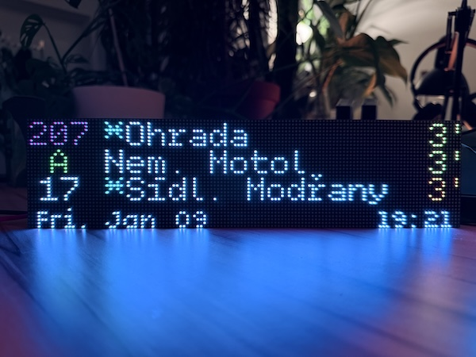

# SpojBoard - Smart Panel for Onward Journeys

An ESP32-based LED matrix display showing real-time transit departures from Prague's Golemio API.

**SPOJ** = **S**mart **P**anel for **O**nward **J**ourneys (also "spoj" = connection/service in Czech)

No external server required - standalone operation with web-based configuration!


*SpojBoard showing real-time departures on a 128×32 LED matrix display*

## Features

- **Direct API Access**: Fetches departure data from Golemio PID API every 30 seconds (configurable)
- **Multi-Stop Support**: Query multiple stops simultaneously, automatically sorted by departure time
- **WiFi Setup Portal**: Automatic AP mode with captive portal when WiFi fails - no code editing needed!
- **Web Configuration**: Easy setup via built-in web interface
- **Persistent Settings**: Configuration stored in ESP32 flash memory, survives reboots
- **Full Czech Character Support**: Custom 8-bit ISO-8859-2 fonts with automatic UTF-8 conversion for perfect display of Czech station names (ž, š, č, ř, ň, ť, ď, etc.)
- **Smart Text Shortening**: Automatic shortening of long destination names (e.g., "Nádraží Hostivař" → "Nádr. Hostivař") to maximize display space
- **Smart Filtering**: Configurable minimum departure time (default 3 minutes) to hide departures that are too soon to catch
- **Real-time Updates**: Shows line number, destination, and ETA in minutes
- **AC Indicator**: Shows asterisk (*) for air-conditioned vehicles
- **Color-coded Lines**: Colored line numbers on black backgrounds for high contrast and readability
- **Custom Line Colors**: Configure custom colors for specific lines via web interface (supports pattern matching with wildcards)
- **Firmware Updates**: GitHub-based OTA updates with user confirmation - check for new releases directly from the web interface

## Hardware

- Adafruit MatrixPortal ESP32-S3
- 2x HUB75 64x32 LED Matrix panels (128x32 total)

## Quick Start

### First Time Setup (AP Mode)

1. **Flash the Firmware**
   ```bash
   pio run -t upload
   ```

2. **Connect to Setup AP**
   - The display will show WiFi credentials:
     ```
     WiFi Setup Mode
     SSID: SpojBoard-XXXX
     Pass: xxxxxxxx
     Go to: 192.168.4.1
     ```
   - Connect your phone/computer to this WiFi network
   - A captive portal should open automatically (or go to http://192.168.4.1)

3. **Configure via Web UI**
   - Enter your home WiFi credentials
   - Enter your Golemio API key (get one at [api.golemio.cz/api-keys](https://api.golemio.cz/api-keys/))
   - Enter your stop ID(s)
   - Click "Save & Connect to WiFi"

4. **Device Connects**
   - The device will restart and connect to your WiFi
   - Find its new IP address on the display or your router
   - Departures will start showing automatically

### If WiFi Fails

If the device can't connect to WiFi (wrong password, network down, etc.), it will automatically:
1. Stop trying after 20 attempts (~10 seconds)
2. Create a new AP with a **random password**
3. Display the credentials on the LED matrix
4. Wait for you to configure new WiFi settings

This ensures you can always access the device for reconfiguration!

## Web Interface

The built-in web server provides:

- **Status Dashboard**: WiFi status, API status, memory usage
- **Configuration Form**:
  - WiFi credentials
  - Golemio API key
  - Stop ID(s) - comma-separated for multiple stops
  - Refresh interval (10-300 seconds)
  - Number of departures to display (1-6)
  - Minimum departure time (0-30 minutes) - filter out departures too soon to catch
  - Display brightness (0-255)
  - Custom line colors with pattern matching (e.g., "9*/9**" for all night lines)
- **Actions**:
  - Force refresh
  - Update firmware (manual .bin upload)
  - Check for updates (GitHub releases)
  - Reboot device
  - Factory reset

### AP Mode vs Normal Mode

| Feature | AP Mode | Normal Mode |
|---------|---------|-------------|
| WiFi | Creates its own network | Connects to your network |
| API Calls | Disabled | Every 30s (configurable) |
| Display | Shows AP credentials | Shows departures |
| Web UI | Setup focused | Full dashboard |

## Getting Your Stop ID

1. Visit [data.pid.cz/stops/xml/StopsByName.xml](http://data.pid.cz/stops/xml/StopsByName.xml)
2. Search for your stop name (Ctrl+F)
3. Find the `gtfsIds` value (e.g., `U693Z2P`)
4. You can enter multiple IDs separated by commas

## Display Layout

### Normal Mode
```
┌────────────────────────────────────┐
│ [31] Sídliště Řepy           12' │  Row 1
│ [7 ] Radlická                 5' │  Row 2
│ [A ] Depo Hostivař            2' │  Row 3
│ Mon, Feb 15             14:35    │  Row 4 (Date/Time)
└────────────────────────────────────┘
```

**Visual Design**:
- Line numbers displayed in their route color on uniform 18-pixel black background boxes (fits 1-3 characters)
- Route numbers are horizontally centered within their boxes for consistent alignment
- All destinations start at the same X position regardless of route length
- Destination text dynamically truncated based on ETA display width to prevent overlap
- High contrast design optimized for LED matrix visibility

### AP Setup Mode
```
┌────────────────────────────────────┐
│ WiFi Setup Mode                   │
│ SSID: SpojBoard-A1B2       │
│ Pass: k7m3p9x2                    │
│ Go to: 192.168.4.1                │
└────────────────────────────────────┘
```

## Color Coding

### Line Numbers (Default Colors)

These colors are used by default and can be customized via the web interface:

- **Green**: Metro A
- **Yellow**: Metro B, Default fallback for all unmapped lines
- **Red**: Metro C
- **White**: Trams 1-29 (e.g., 2, 5, 7, 10, 12, 15, 17, 22)
- **Purple**: 3-digit trams 100-299 (e.g., 100, 102, 200)
- **Blue**: S-trains (S1, S2, S3, etc.)
- **Cyan**: Night lines 91-99, 900-999

**Customizing Line Colors:**
- Configure specific colors for individual lines (e.g., "A=RED")
- Use pattern matching with trailing asterisk (e.g., "9*=CYAN" matches all lines starting with 9)
- Exact matches take priority over patterns
- Unmapped lines use the hardcoded defaults above
- Available colors: RED, GREEN, BLUE, YELLOW, ORANGE, PURPLE, CYAN, WHITE

### ETA Colors
- **White**: > 5 minutes
- **Yellow**: 2-5 minutes
- **Red**: < 2 minutes
- **Orange**: Delayed

## Troubleshooting

### Can't Connect to AP
- Make sure you're connecting to the right network (SpojBoard-XXXX)
- The password is case-sensitive and shown on the display
- Try forgetting the network and reconnecting

### "API Error: HTTP 401"
- Invalid API key - check your key at api.golemio.cz

### "API Error: HTTP 429"
- Rate limited - increase refresh interval

### "No Departures"
- Check stop ID is correct
- Some stops may have no service at certain times

### Device Keeps Going to AP Mode
- Double-check your WiFi password
- Make sure your WiFi is 2.4GHz (ESP32-S3 doesn't support 5GHz)
- Check if your router is blocking new devices

### Display Issues
- Check HUB75 cable connections
- Verify panel chain order

## Firmware Updates

SpojBoard supports two methods for updating firmware:

### Method 1: GitHub Updates (Recommended)

Check for and install new releases directly from GitHub:

1. **Open the web interface** at `http://[device-ip]/`
2. **Click "Check for Updates"** in the Actions section
3. **Review the update** (version, release notes, file size)
4. **Click "Download & Install"** if update is available
5. **Wait for download** - progress shown on LED matrix
6. **Device reboots automatically** with new firmware

**Features:**
- ✅ Automatic version checking
- ✅ Displays release notes before installing
- ✅ Secure HTTPS download with MD5 validation
- ✅ Progress display on LED matrix
- ✅ Safe - failed update doesn't brick the device

**Requirements:**
- Device must be connected to WiFi (not in AP mode)
- Internet access to github.com

### Method 2: Manual Upload

Upload a firmware .bin file manually:

1. **Get the firmware file** (e.g., `spojboard-r2-abc12345.bin`)
2. **Open web interface** and click "Update Firmware"
3. **Select .bin file** and click "Upload Firmware"
4. **Wait for upload** - progress shown on screen
5. **Device reboots** after successful upload

**Use cases:**
- Installing custom firmware builds
- Offline updates
- Development testing

### Update Security

All firmware updates (both methods):
- ❌ **Disabled in AP mode** (prevents unauthorized access)
- ✅ **MD5 validation** (corrupted firmware rejected)
- ✅ **HTTPS only** for GitHub downloads
- ✅ **Separate OTA partition** (failed update doesn't affect running firmware)
- ✅ **User confirmation required** (no automatic updates)

### Troubleshooting Updates

**"Updates not available in AP mode"**
- Connect device to your WiFi network first
- AP mode blocks updates for security

**"No update available"**
- Your device is already running the latest version
- Check [GitHub Releases](https://github.com/xbach/spojboard-firmware/releases) to verify

**"Download failed" or "Installation failed"**
- Check internet connection
- Try again - download may have been interrupted
- Verify you have enough space (firmware ~1-2 MB)

**"GitHub API error" or "Rate limit exceeded"**
- GitHub limits: 60 requests per hour for unauthenticated users
- Wait an hour and try again
- This is normal and not a device issue

## Architecture

The codebase follows a modular, layered architecture with zero circular dependencies:

```
src/
├── main.cpp                          # Application orchestration (340 lines)
├── config/
│   ├── AppConfig.h/cpp              # Configuration structure & NVS persistence
├── display/
│   ├── DisplayManager.h/cpp         # Display rendering & layout
│   ├── DisplayColors.h/cpp          # Color system & line color mapping
├── api/
│   ├── GolemioAPI.h/cpp             # API client for Golemio
│   ├── DepartureData.h/cpp          # Data structures & utilities
├── network/
│   ├── WiFiManager.h/cpp            # WiFi connection & AP mode
│   ├── CaptivePortal.h/cpp          # DNS server & captive portal
│   ├── ConfigWebServer.h/cpp        # Web interface handlers
│   ├── OTAUpdateManager.h/cpp       # OTA firmware upload handling
│   ├── GitHubOTA.h/cpp              # GitHub releases integration
└── utils/
    ├── Logger.h/cpp                 # Logging utilities
    ├── TimeUtils.h/cpp              # NTP sync & time formatting
    ├── gfxlatin2.h/cpp              # UTF-8 to ISO-8859-2 conversion
    └── decodeutf8.h/cpp             # UTF-8 decoder
```

### Design Principles

**Layered Dependencies** (lower layers never depend on higher layers):
1. **Foundation Layer**: Logger, UTF-8 utilities
2. **Data Layer**: AppConfig, DepartureData
3. **Hardware Layer**: TimeUtils, DisplayColors, DisplayManager
4. **Network Layer**: CaptivePortal, WiFiManager, ConfigWebServer
5. **Business Logic**: GolemioAPI
6. **Application**: main.cpp (orchestrates all modules)

**Key Patterns**:
- **Zero Circular Dependencies**: Strict unidirectional dependency flow
- **Single Responsibility**: Each module has one clear purpose
- **Callback Pattern**: Modules communicate upward via callbacks (e.g., ConfigWebServer → main.cpp)
- **Pure Data Structures**: Config passed as parameter, not stored in modules
- **Static Allocation**: No dynamic allocation in main loop for stability

## Technical Details

### AP Mode Credentials
- SSID: `SpojBoard-XXXX` (XXXX = last 4 chars of MAC address)
- Password: 8 random alphanumeric characters (regenerated each time)
- IP: `192.168.4.1`

### Captive Portal
The device implements captive portal detection for:
- Android (`/generate_204`, `/gen_204`)
- iOS/macOS (`/hotspot-detect.html`)
- Windows (`/ncsi.txt`, `/connecttest.txt`)
- Firefox (`/success.txt`)

### Memory Usage
- JSON buffer: 8KB for API responses
- Configuration stored in NVS flash
- Typical free heap: ~200KB
- RAM usage: 21.4% (70KB used of 327KB)
- Flash usage: 94.7% (1.24MB used of 1.31MB)

### Multi-Stop Behavior
When multiple stop IDs are configured (comma-separated), the system:
1. Queries each stop individually via separate API calls (with 1-second delay between calls to reduce server load)
2. Collects all departures (up to 30 total)
3. Sorts by ETA (earliest departures first)
4. Applies minimum departure time filter
5. Displays the top N results (configurable 1-6)

This ensures you always see the **soonest** departures across all your stops, regardless of which stop they come from. The 1-second delay between API calls helps avoid rate limiting and reduces load on the Golemio API servers.

### Destination String Shortening
To maximize display space on the 128×32 LED matrix, long Czech destination names are automatically shortened before display, like:
- "Nádraží" → "Nádr."

The shortening is applied before UTF-8 to ISO-8859-2 conversion, ensuring Czech diacritics are preserved correctly.

## Czech Character Support

This project implements full support for Czech diacritical characters using a custom 8-bit font system.

### The Problem
Standard Adafruit GFX fonts use 7-bit encoding (ASCII 0x20-0x7E), which doesn't include Czech characters like **ž, š, č, ř, ň, ť, ď, ú, ů, á, é, í, ó, ý**. The Golemio API returns station names in UTF-8 encoding (e.g., "Nádraží Hostivař", "Karlovo náměstí").

### The Solution
We use **8-bit ISO-8859-2 fonts** with automatic UTF-8 conversion:

1. **Custom Fonts**: Generated from TrueType fonts using `fontconvert8` tool
   - Character range: 0x20-0xDF (192 printable characters)
   - Includes full Latin Extended-A for Central European languages
   - Stored as Adafruit GFX format in PROGMEM

2. **UTF-8 Decoder**: Converts multi-byte UTF-8 to Unicode code points (RFC 3629)
   - Located in `src/utils/decodeutf8.cpp/h`

3. **ISO-8859-2 Mapper**: Maps Unicode to ISO-8859-2 with GFX encoding
   - Characters 0xA0-0xFF are shifted by -32 to fit in 0x80-0xDF range
   - Located in `src/utils/gfxlatin2.cpp/h`
   - In-place conversion using `utf8tocp(char* str)` function

**Example conversion**:
```
UTF-8: "Nádraží"    → Bytes: 0x4E 0xC3 0xA1 0x64 0x72 0x61 0xC5 0xBE 0xC3 0xAD
                     ↓ decode UTF-8
Unicode: N á d r a ž í → Code points: U+004E U+00E1 U+0064 U+0072 U+0061 U+017E U+00ED
                     ↓ map to ISO-8859-2 with shift
ISO-8859-2: 0x4E 0xC1 0x64 0x72 0x61 0xBE 0xCD → Display correctly on LED matrix
```

**Credit**: Based on work by [Michel Deslierres](https://sigmdel.ca/michel/program/misc/gfxfont_8bit_en.html) and adapted from [Petr Brouzda's fontconvert8-iso8859-2](https://github.com/petrbrouzda/fontconvert8-iso8859-2).

## Creating Custom Fonts

To create your own 8-bit ISO-8859-2 fonts:

### Prerequisites
- TrueFont (.ttf) or OpenType (.otf) font file
- Modified fontconvert8 tool (works on Mac M-series)

### Using fontconvert8-iso8859-2

The [fontconvert8-iso8859-2](https://github.com/petrbrouzda/fontconvert8-iso8859-2) repository contains the necessary tools with modifications for macOS compatibility.

**Basic usage**:
```bash
# Clone the tool repository
git clone https://github.com/petrbrouzda/fontconvert8-iso8859-2.git
cd fontconvert8-iso8859-2/fontconvert8

# Build the tool (may need modifications for M-series Macs)
make

# Convert a font
./fontconvert YourFont.ttf 12 > YourFont12pt8b.h
```

**Font naming convention**: `FontName[size]pt8b.h`
- `8b` = 8-bit encoding
- Size = point size

### Integration Steps

1. **Generate the font file** with fontconvert8
2. **Copy to `src/fonts` directory** in your project
3. **Include in the appropriate module** (e.g., `src/display/DisplayManager.cpp`):
   ```cpp
   #include "../fonts/YourFont12pt8b.h"
   ```
4. **Set as active font** in your display code:
   ```cpp
   const GFXfont *fontMedium = &YourFont12pt8b;
   display->setFont(fontMedium);
   ```
5. **Rebuild and flash**

### Mac M-Series Compatibility
The original fontconvert8 tool may require modifications to compile on Apple Silicon. The fork used in this project includes necessary adjustments for ARM64 architecture. If you encounter build issues, you may need to:
- Update Makefile compiler flags
- Install FreeType2 via Homebrew (`brew install freetype`)
- Adjust include paths for ARM architecture

### Fine-Tuning with GFX Font Customiser

After generating fonts with fontconvert8, you can fine-tune individual characters using the [Adafruit GFX Font Customiser by tchapi](https://tchapi.github.io/Adafruit-GFX-Font-Customiser/).

This web-based tool allows you to:
- **Visualize** the generated font in a browser
- **Edit individual glyphs** pixel by pixel
- **Adjust spacing** and kerning
- **Add or modify characters** not in the original font
- **Export** the modified font as a .h file

**Workflow**:
1. Generate base font with fontconvert8
2. Open the .h file in the GFX Font Customiser
3. Make visual adjustments to improve readability on LED matrix
4. Export and replace the original .h file

The fonts in this project (DepartureMono4pt8b, DepartureMono5pt8b) were customized using this tool to optimize character spacing and appearance on the 128×32 LED matrix display.

## License

This project is licensed under the **GNU General Public License v3.0 (GPL-3.0)**.

This means you are free to:
- ✅ Use this code for personal or commercial purposes
- ✅ Modify and distribute the code
- ✅ Create derivative works

**However, you must**:
- 📝 Disclose the source code of any derivative works
- 📝 License derivative works under GPL-3.0
- 📝 Include copyright and license notices

See the LICENSE file for full details.

## Credits

- [Golemio API](https://api.golemio.cz) - Prague open data platform
- [ESP32-HUB75-MatrixPanel-DMA](https://github.com/mrfaptastic/ESP32-HUB75-MatrixPanel-DMA) - Display driver
- [Adafruit GFX Library](https://github.com/adafruit/Adafruit-GFX-Library) - Graphics primitives and font rendering
- [Adafruit GFX Font Customiser by tchapi](https://tchapi.github.io/Adafruit-GFX-Font-Customiser/)
- [Michel Deslierres](https://sigmdel.ca/michel/program/misc/gfxfont_8bit_en.html) - Original UTF-8 to ISO-8859-2 conversion code
- [Petr Brouzda - fontconvert8-iso8859-2](https://github.com/petrbrouzda/fontconvert8-iso8859-2) - Font conversion tool and UTF-8 conversion implementation
- [Claude Code](https://claude.ai/code) - AI-assisted development and code refinement
- [DepartureMono font family](https://departuremono.com/) - Custom 8-bit GFXfonts with ISO-8859-2 character support