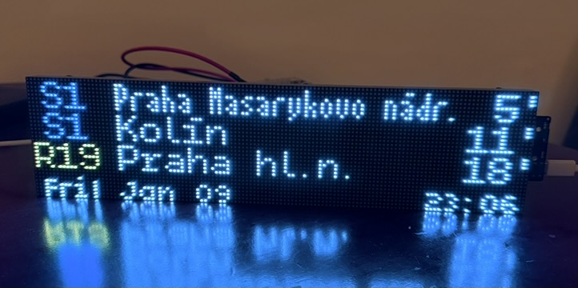
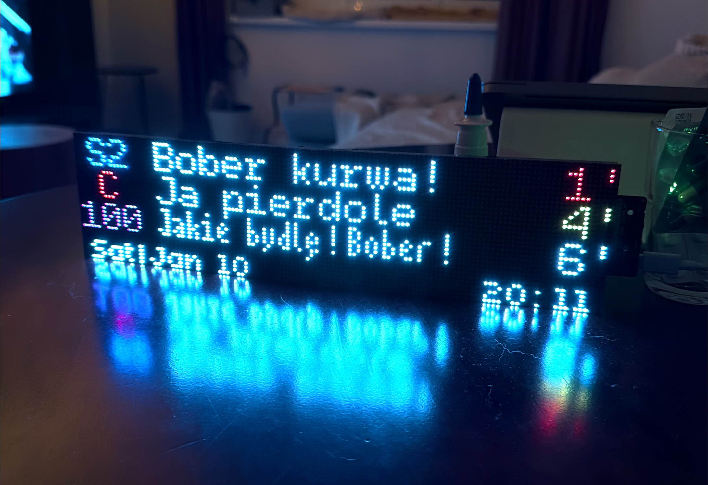
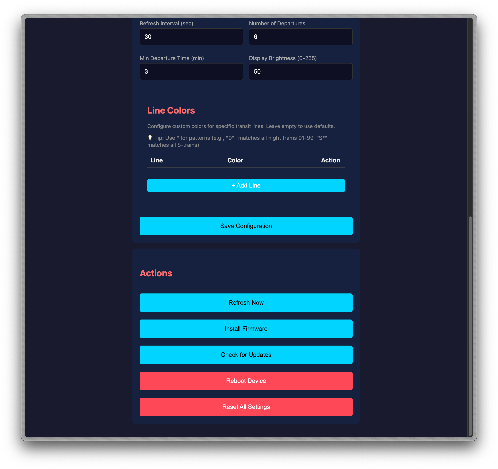

# SpojBoard Screenshots

Visual overview of SpojBoard hardware and web interface.

## Hardware

### Device in Action

The SpojBoard displaying real-time Prague transit departures on a 128×32 HUB75 LED matrix panel.

## Adaptive Font Rendering

### Condensed Font for Long Destinations

Automatically switches to condensed font when destination names exceed 16 characters, fitting up to 23 characters on screen while maintaining readability.

## Demo Mode

### Anything Goes if it Fits

## Web Interface

### Main Configuration Screen

Web-based configuration interface showing:
- WiFi settings (SSID and password)
- Golemio API key configuration
- Stop ID management with multi-stop support
- Display preferences (refresh interval, number of departures, minimum departure time)
- Brightness control
- Custom line color mapping with pattern matching support

### Configuration Details

Additional configuration options including:
- Display brightness slider (0-255)
- Custom line colors with wildcard pattern support (e.g., "9*=CYAN" for all night lines)
- Action buttons for refresh, firmware update, and reboot
- GitHub-based OTA update checker
- Factory reset option

## Features Shown

- **Color-coded line numbers** with uniform black background boxes
- **Adaptive font system** for optimal text display
- **Real-time ETA** with color-coded urgency (white, yellow, red)
- **AC indicator** (asterisk) for air-conditioned vehicles
- **Czech character support** with proper diacritics (ř, ž, š, č, etc.)
- **Web configuration** accessible from any device
- **Custom line colors** with flexible pattern matching

---

[← Back to README](../README.md)
